# Luồng Hoạt Động Training System

## 📊 Tổng Quan Training Flow

```mermaid
graph TB
    Start([User chạy training]) --> CLI[training/train.py]
    CLI --> LoadEnv[Load .env]
    LoadEnv --> ParseArgs[Parse CLI arguments]
    ParseArgs --> Config[Tạo TrainingConfig]
    
    Config --> OTLP[Setup OTLP Exporter]
    OTLP --> Database[Setup Database]
    Database --> Dataset[Generate Datasets]
    
    Dataset --> Train[Training Dataset]
    Dataset --> Val[Validation Dataset]
    
    Train --> Trainer[Setup Trainer với APO]
    Val --> Trainer
    
    Trainer --> Loop{Training Loop<br/>Max Iterations}
    
    Loop -->|Each Iteration| Rollout[@rollout Function]
    Rollout --> Agent[Create Agno Agent<br/>with Prompt]
    Agent --> Execute[Run Task]
    Execute --> Grade[Calculate Reward]
    Grade --> Traces[Send Traces to OTLP]
    
    Traces --> Algorithm[APO Algorithm<br/>Analyze Rewards]
    Algorithm --> NewPrompt[Generate Better Prompt]
    NewPrompt -->|Next Iteration| Loop
    
    Loop -->|Done| Results[Training Complete]
    Results --> Save[Save to Database]
    Save --> End([End])
    
    style CLI fill:#FFD700
    style Trainer fill:#90EE90
    style Rollout fill:#87CEEB
    style Algorithm fill:#FF6B6B
    style OTLP fill:#9370DB
```

---

## 🔄 Chi Tiết Training Loop


---

## 🎯 Rollout Function Chi Tiết

```mermaid
flowchart TD
    Start([Rollout được gọi]) --> Input[Nhận Input:<br/>- Task<br/>- Prompt Template<br/>- Config]
    
    Input --> CreateAgent[Tạo Agno Agent]
    CreateAgent --> ParsePrompt[Parse prompt thành<br/>instructions list]
    ParsePrompt --> InitAgent[Initialize Agent với:<br/>- OpenAI GPT-4o-mini<br/>- Tools sum_1_to_n, calculator<br/>- Custom instructions]
    
    InitAgent --> RunTask[agent.run task.question]
    
    RunTask --> LLM{LLM Processing}
    LLM -->|Need calculation| CallTool[Call Tool]
    CallTool --> ToolResult[Get Tool Result]
    ToolResult --> LLM
    LLM -->|Done| Response[Generate Response]
    
    Response --> Extract[Extract Answer<br/>từ response text]
    Extract --> Regex[Regex patterns:<br/>- answer is X<br/>- result: X<br/>- number only]
    
    Regex --> Compare{Compare với<br/>expected_answer}
    
    Compare -->|Exact Match| Reward1[Reward = 1.0]
    Compare -->|Close 10%| Reward2[Reward = 0.5-1.0<br/>partial credit]
    Compare -->|Wrong| Reward3[Reward = 0.0]
    
    Reward1 --> Log[Log kết quả]
    Reward2 --> Log
    Reward3 --> Log
    
    Log --> SendTrace[Send traces qua OTLP]
    SendTrace --> Return([Return reward])
    
    style CreateAgent fill:#FFE5B4
    style RunTask fill:#B4E5FF
    style Compare fill:#FFB4B4
    style SendTrace fill:#E5B4FF
```



---

## 💾 Data Flow Through Components

```mermaid
graph LR
    subgraph Input
        CLI[CLI Args]
        Env[.env File]
    end
    
    subgraph Configuration
        TC[TrainingConfig]
        AC[AgentConfig]
    end
    
    subgraph Data Generation
        DG[Dataset Generator]
        Tasks[(Math Tasks)]
    end
    
    subgraph Training Engine
        T[Trainer]
        APO[APO Algorithm]
    end
    
    subgraph Execution
        RF[@rollout Function]
        AM[AgentManager]
        A[Agno Agent]
    end
    
    subgraph Evaluation
        RG[Reward Grader]
        Rewards[(Rewards)]
    end
    
    subgraph Observability
        OTLP[OTLP Exporter]
        Traces[(Traces)]
    end
    
    subgraph Storage
        DB[(Training DB)]
    end
    
    CLI --> TC
    Env --> AC
    TC --> DG
    DG --> Tasks
    Tasks --> T
    AC --> T
    
    T <--> APO
    APO -->|Prompts| RF
    RF --> AM
    AM --> A
    A -->|Response| RF
    
    RF --> RG
    RG --> Rewards
    Rewards --> APO
    
    A --> OTLP
    OTLP --> Traces
    Traces --> DB
    Rewards --> DB
    
    style T fill:#90EE90
    style APO fill:#FF6B6B
    style OTLP fill:#9370DB
    style DB fill:#FFD700
```

---

## 🔍 Component Interactions Matrix

| Component | Calls | Called By | Data Produced | Data Consumed |
|-----------|-------|-----------|---------------|---------------|
| **train.py** | Config, OTLP, Dataset, Trainer | User | None | CLI args, .env |
| **TrainingConfig** | None | train.py | Config object | None |
| **Dataset Generator** | None | train.py | MathTask list | Config params |
| **OTLP Setup** | OpenTelemetry SDK | train.py | TracerProvider | OTLP endpoint |
| **Trainer** | APO, Rollout | train.py | Final results | Datasets, config |
| **APO Algorithm** | None | Trainer | Prompt templates | Rewards, traces |
| **@rollout** | AgentManager, Grader | Trainer | Reward (float) | Task, prompt |
| **AgentManager** | Agno Agent SDK | @rollout | Agent instance | Prompt, config |
| **Agno Agent** | OpenAI API, Tools | AgentManager | Response text | Question |
| **Tools** | None | Agno Agent | Calculation result | Numbers |
| **Reward Grader** | Regex | @rollout | Reward score | Response, expected |
| **Database** | None | Various | Persistent storage | Traces, rewards |

---

## ⚡ Execution Timeline

```mermaid
gantt
    title Training Execution Timeline (10 iterations)
    dateFormat X
    axisFormat %s
    
    section Initialization
    Load configs           :0, 1s
    Setup OTLP            :1s, 2s
    Generate datasets     :2s, 1s
    Create trainer        :3s, 1s
    
    section Training Loop
    Iteration 1           :4s, 5s
    Iteration 2           :9s, 5s
    Iteration 3           :14s, 5s
    Iteration 4-7         :19s, 20s
    Iteration 8-10        :39s, 15s
    
    section Finalization
    Save results          :54s, 2s
    Cleanup               :56s, 1s
```

---

## 🎓 Training Algorithms Available

```mermaid
graph TD
    Algorithm{Choose Algorithm}
    
    Algorithm -->|--algorithm apo| APO[APO<br/>Automatic Prompt<br/>Optimization]
    Algorithm -->|--algorithm sft| SFT[SFT<br/>Supervised<br/>Fine-Tuning]
    Algorithm -->|--algorithm rl| RL[RL<br/>Reinforcement<br/>Learning]
    
    APO --> APOWork[Tự động optimize prompts<br/>dựa trên rewards]
    SFT --> SFTWork[Fine-tune model<br/>với supervised data]
    RL --> RLWork[Train với<br/>reward signals]
    
    APOWork --> Result[Better Prompts]
    SFTWork --> Result
    RLWork --> Result
    
    style APO fill:#90EE90
    style SFT fill:#FFB6C1
    style RL fill:#87CEEB
```



---

## 📝 Example Training Session

### Input
```bash
python -m training.train --iterations 3 --train-size 5
```

### Iteration 1
```
Prompt: "You are a helpful assistant. Solve math problems."
Tasks: 5 math problems
Rewards: [0.2, 0.4, 0.6, 0.3, 0.5]
Average: 0.40
```

### Iteration 2
```
Prompt: "You are a math expert. Use tools for calculations. 
        Show your work step by step."
Tasks: 5 math problems
Rewards: [0.8, 0.9, 0.7, 1.0, 0.8]
Average: 0.84
```

### Iteration 3
```
Prompt: "You are a precise math assistant. Always use the 
        sum_1_to_n tool. Verify your answer."
Tasks: 5 math problems
Rewards: [1.0, 1.0, 1.0, 0.9, 1.0]
Average: 0.98
```

### Result
✅ **Improvement:** 0.40 → 0.98 (145% increase!)

---

## 🔧 How to Trace Training

### View OTLP Traces (if Jaeger running)

```bash
# Start Jaeger
docker run -d -p 4318:4318 -p 16686:16686 jaegertracing/all-in-one

# Run training
python -m training.train

# View traces
open http://localhost:16686
```

### View Database

```bash
# Training database location
ls -la agno_memory_training.db/

# Contains:
# - agno_sessions.json
# - agno_runs.json  
# - agno_spans.json  ← Traces here!
```

---

## 🎯 Key Takeaways

1. **Training is iterative:** APO algorithm improves prompts over multiple iterations
2. **Rewards drive learning:** Better rewards → Better prompts
3. **OTLP captures everything:** All execution traces sent to collector
4. **Tools are crucial:** Agent uses sum_1_to_n & calculator tools
5. **Grading is automatic:** Reward grader compares answers
6. **Parallel execution:** Multiple tasks run concurrently per iteration
7. **Database persistence:** All data saved for analysis

---

## 📊 Current Configuration

```yaml
Training:
  Algorithm: APO (Automatic Prompt Optimization)
  Max Iterations: 10
  Train Size: 20 tasks
  Val Size: 10 tasks
  Runners: 8 parallel

Agent:
  Model: gpt-4o-mini
  Tools:
    - sum_1_to_n
    - calculator
  
Reward:
  Exact Match: 1.0
  Partial Credit: 0.5-1.0 (within 10% tolerance)
  Wrong Answer: 0.0

OTLP:
  Endpoint: http://localhost:4318/v1/traces
  Exporter: HTTP
```

---

## 🚀 To Run Training

```bash
# Dry run (test setup)
python -m training.train --dry-run

# Full training
python -m training.train

# Custom config
python -m training.train --iterations 20 --train-size 50 --algorithm apo
```
